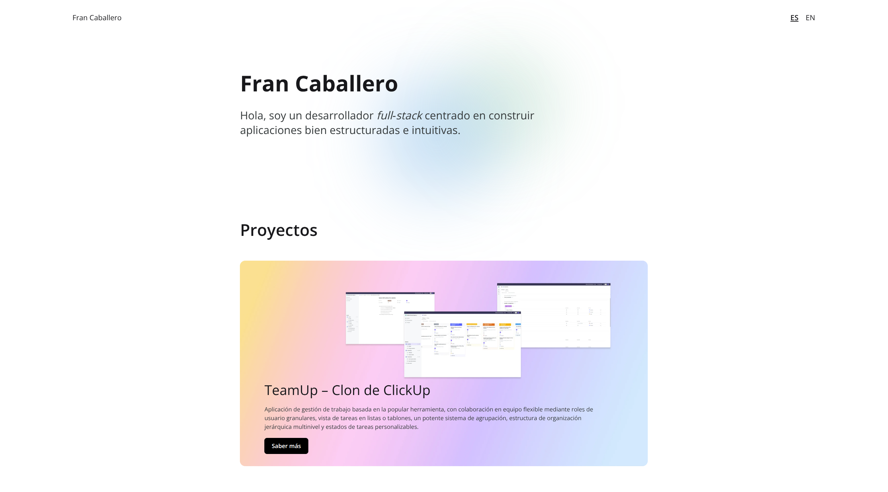

# Portfolio Website

This is my personal portfolio built with Astro, available in English and Spanish. It includes a case study for TeamUp, a ClickUp clone project.

- Live site: [English](https://fran-caballero.dev/en) / [Español](https://fran-caballero.dev)
- TeamUp case study: https://fran-caballero.dev/en/teamup

## Preview

<p align="center">
  <a href="images/portfolio-website.png">
    
  </a>
</p>

## Tech Stack

- Astro
- TypeScript
- Tailwind CSS

## Getting Started

```bash
npm install
npm run dev
```

The local site runs at:

```text
http://localhost:4321
```

## Project Status

The portfolio is actively maintained as my work evolves.
